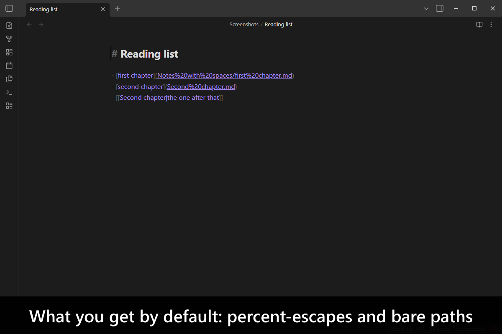
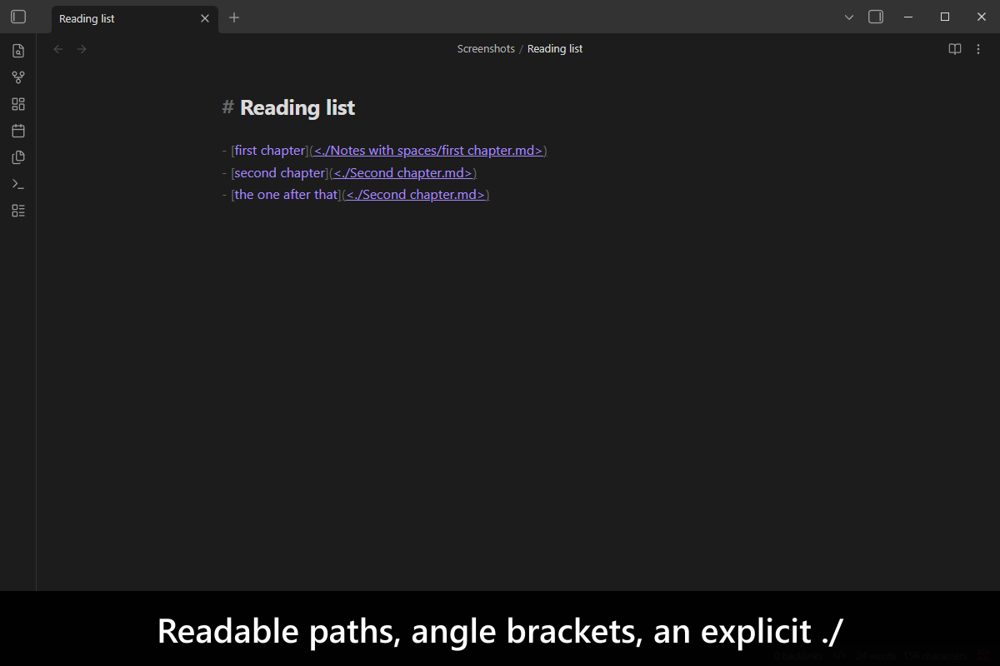
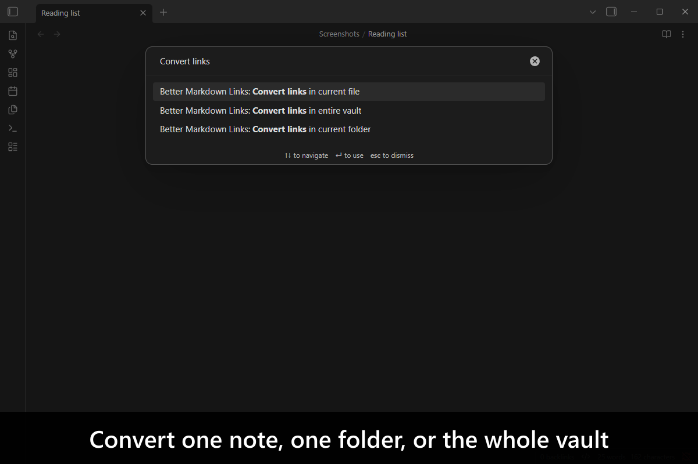
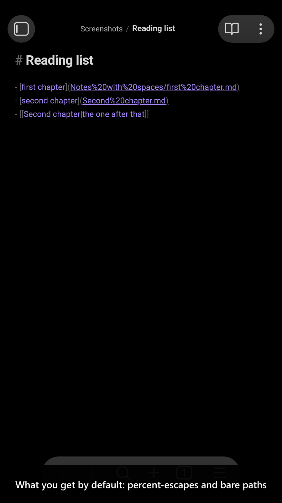
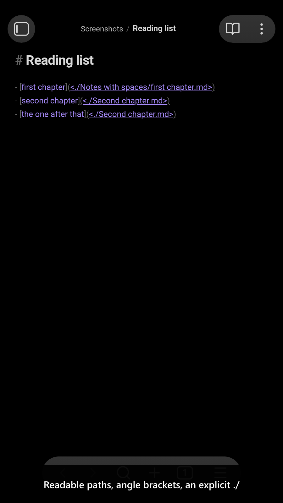
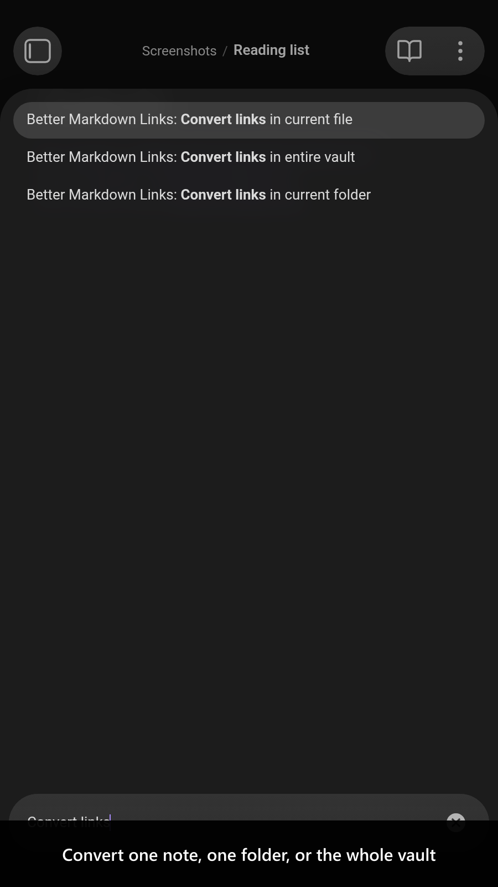

# Better Markdown Links

[](https://www.buymeacoffee.com/mnaoumov)
[](https://github.com/mnaoumov/obsidian-better-markdown-links/releases)
[](https://github.com/mnaoumov/obsidian-better-markdown-links/releases)
[](https://github.com/mnaoumov/obsidian-better-markdown-links)

`[[Wikilinks]]` are not part of the Markdown spec, so a vault that uses them stops making sense outside
[Obsidian]. Switch to Markdown links and you hit the next problem: Obsidian writes
`[Title](path%20with%20space/note%20with%20space.md)`, which is unreadable, and it writes relative paths
without a leading `./`, which other editors resolve differently than Obsidian does — the same link, two
meanings.

This plugin makes Obsidian generate the readable, unambiguous form instead: angle brackets around paths
with spaces, an explicit `./` on relative links, and tidy `file://` URLs. It can also convert the links
you already have, in one note, one folder, or the whole vault.

<!-- markdownlint-disable MD033 -->

<a href="images/screenshots/screenshot-desktop-1.png"></a>

<details>
<summary>More screenshots</summary>

<a href="images/screenshots/screenshot-desktop-2.png"></a>
<a href="images/screenshots/screenshot-desktop-3.png"></a>
<a href="images/screenshots/screenshot-mobile-1.png"></a>
<a href="images/screenshots/screenshot-mobile-2.png"></a>
<a href="images/screenshots/screenshot-mobile-3.png"></a>

</details>

<!-- markdownlint-enable MD033 -->

## Demo vault

**The documentation is a demo vault.** Every feature has a note that explains what it does and why you
would want it, with awkward paths already in place to try it against.

**[Start reading here](<./demo-vault/00 Start.md>)** — it is plain markdown, so it works on GitHub with
nothing installed.

A copy of the vault ships with every release. You can access it via any of the following:

1. Running the **Better Markdown Links: Open demo vault** command.
2. Downloading `better-markdown-links-demo-vault-<version>.zip` (`<version>` is the release version) from the [Releases](https://github.com/mnaoumov/obsidian-better-markdown-links/releases).
3. Browsing its source in [`demo-vault/`](./demo-vault/README.md) in this repository.

## What it does

- **Angle bracket links** — `[Title](<path with space/note with space.md>)` instead of `%20` noise. The
  Markdown spec allows it and Obsidian understands it; Obsidian just never generates it.
  [01 Angle bracket links](<./demo-vault/01 Angle bracket links.md>)
- **Explicit relative links** — a leading `./`, so a relative path cannot be
  [mistaken for an absolute one](https://forum.obsidian.md/t/add-settings-to-control-link-resolution-mode/69560)
  by anything that reads your vault.
  [02 Relative links](<./demo-vault/02 Relative links.md>)
- **Convert what you already have** — one note, one folder, or the whole vault; on command, on save, on
  auto-save, or on every modification, whichever suits how eagerly you want it to work.
  [03 Convert links](<./demo-vault/03 Convert links.md>)
- **`file://` normalization** — `[note](file:///C:%5Cnotes%5Ctodo.md)` becomes
  `[note](file:///C:/notes/todo.md)`. Other links are left alone.
  [03 Convert links](<./demo-vault/03 Convert links.md>)
- **Links keep working when notes move** — renames and moves update the links pointing at them.
  [04 Settings](<./demo-vault/04 Settings.md>)

## For plugin developers

This plugin adds an [additional overload](./src/generate-markdown-link-extended.d.ts) to
[`app.fileManager.generateMarkdownLink()`][generateMarkdownLink]. To use the extended signature from
your own plugin, copy
[`generate-markdown-link-extended.d.ts`](./src/generate-markdown-link-extended.d.ts) into your code.

## Integration with other plugins

This plugin handles rename and delete events according to its settings. Similar handlers ship in:

- [`Consistent Attachments and Links`](https://obsidian.md/plugins?id=consistent-attachments-and-links)
- [`Custom Attachment Location`](https://obsidian.md/plugins?id=obsidian-custom-attachment-location)

Those handlers are designed to work with each other, so the plugins can be installed together.

For better performance on a large vault, consider also installing
[Backlink Cache](https://obsidian.md/plugins?id=backlink-cache).

## Installation

The plugin is available in [the official Community Plugins repository](https://obsidian.md/plugins?id=better-markdown-links).

### Beta versions

To install the latest beta release of this plugin (regardless if it is available in [the official Community Plugins repository](https://obsidian.md/plugins) or not), follow these steps:

1. Ensure you have the [BRAT plugin](https://obsidian.md/plugins?id=obsidian42-brat) installed and enabled.
2. Click [Install via BRAT](https://intradeus.github.io/http-protocol-redirector?r=obsidian://brat?plugin=https://github.com/mnaoumov/obsidian-better-markdown-links).
3. An Obsidian pop-up window should appear. In the window, click the `Add plugin` button once and wait a few seconds for the plugin to install.

## Debugging

By default, debug messages for this plugin are hidden.

To show them, run the following command:

```js
window.DEBUG.enable('better-markdown-links');
```

For more details, refer to the [documentation](https://mnaoumov.dev/obsidian-dev-utils/guides/debugging/).

## Changelog

All notable changes to this project will be documented in the [CHANGELOG](./CHANGELOG.md).

## Contributing

Contributions are welcome — see [CONTRIBUTING](./CONTRIBUTING.md) to get set up.

## Support

<!-- markdownlint-disable MD033 -->

<a href="https://www.buymeacoffee.com/mnaoumov" target="_blank"></a>

<!-- markdownlint-enable MD033 -->

## My other Obsidian resources

[See my other Obsidian resources](https://github.com/mnaoumov/obsidian-resources).

## License

© [Michael Naumov](https://github.com/mnaoumov/)

[Obsidian]: https://obsidian.md/
[generateMarkdownLink]: https://docs.obsidian.md/Reference/TypeScript+API/FileManager/generateMarkdownLink
